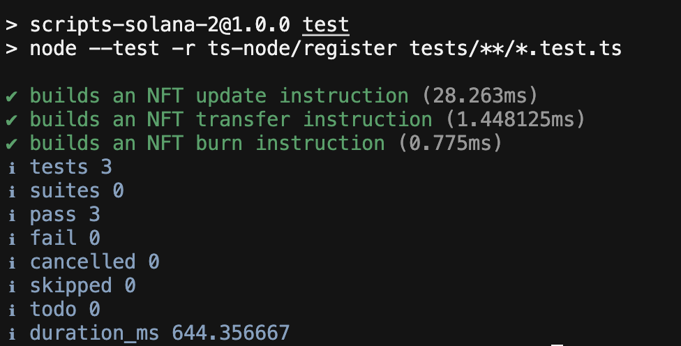

# Week 1 Assignment — SPL Token and NFT



TypeScript scripts for the Turbin3 Week 1 assignment on Solana devnet. The project creates and transfers an SPL token, mints and updates an MPL Core NFT, then completes the optional ownership transfer and burn challenges.

## Completed tasks

- Mint and transfer an SPL token.
- Mint an NFT with MPL Core.
- Update the NFT name and metadata as its update authority.
- Transfer the NFT to another wallet.
- Burn the NFT and reclaim most of the asset account rent.

## Verified devnet run

The complete workflow was simulated, submitted, confirmed, and read back through RPC on September 2, 2026.

| Step | Verified result |
|---|---|
| SPL mint account | [`4y2UoGff2mM3N3RNosKbasM6JSKUkPBoBSqeocvNnyWY`](https://explorer.solana.com/address/4y2UoGff2mM3N3RNosKbasM6JSKUkPBoBSqeocvNnyWY?cluster=devnet), initialized with 6 decimals |
| SPL metadata | [`Q326 Devnet Token / Q326`](https://explorer.solana.com/tx/fLRerVR85o1j8FJZvjUNLX48wPvp5NmRac1aPSpC5opxvzaUD7uGAkTPyqEqPBK93B7aDbByrKsY37Ra369QYsY?cluster=devnet) with an accessible Irys JSON URI |
| SPL mint | [`150 Q326`](https://explorer.solana.com/tx/VfiQ1PtwduazKH2kG7ijeDgTxafT4tXo76Jqg1qoMe9EzEpaD2YzySe75z2EYJNZCoCwt5ujJevUtqi4o9Hggww?cluster=devnet) minted to the owner ATA |
| SPL transfer | [`150 Q326`](https://explorer.solana.com/tx/21wU7ZuVi4SThPYKSR9LhV8Bu8KcAhHQdCwhDxLgWN5actGQGLQesvTN8UhWig1EW7CJYpsKGktLH7P1AMkpezbw?cluster=devnet) transferred; source balance `0`, destination balance `150` |
| MPL Core mint | Asset [`CCQrGd3VYDguaZ3QrV2CgTRLGFZeDMaij34BcFyfZsMn`](https://explorer.solana.com/address/CCQrGd3VYDguaZ3QrV2CgTRLGFZeDMaij34BcFyfZsMn?cluster=devnet) created as `Q326 Core NFT` |
| MPL Core update | [Name and URI updated](https://explorer.solana.com/tx/4wma4TvJ8Zcvrh6FjqX5hUkh1rp3Z37Z3R2pm88Qm6NciSXhyzPggFMJNNhkeQm8BWvtak4gwXi2vNbxJDvnHUdZ?cluster=devnet) to `Q326 Core NFT Updated` |
| MPL Core transfer | [Ownership transferred](https://explorer.solana.com/tx/61JkUZV1DphVqJTsafuSYJ38AoGdZMQvxqGAEB1fzjEbYZ4tyVyKeWTdXHrXfJ7zPnhPP6djtS78QAm5vvEi9YNt?cluster=devnet) to `3VGj7hSBPAhdq9bkLhuh6tmQkktYuA26zvCaJhHc4nPL` |
| MPL Core burn | Test asset [`3X9reHgC1vYGpqBhM33BUMDuaQcj6uXqfUbyfWbELEih`](https://explorer.solana.com/address/3X9reHgC1vYGpqBhM33BUMDuaQcj6uXqfUbyfWbELEih?cluster=devnet) [burned permanently](https://explorer.solana.com/tx/5DZRTjTDZpaXXJSeAHaYKLv1LgXGuM7syjuowf3E99aeVqVHt621phF7TVWsZeEyJPAvc5PRNyznD5GffUmh4rbt?cluster=devnet); `987,948` lamports released |

## Requirements

- Node.js 20.18 or newer
- npm
- A funded Solana devnet wallet
- HTTPS and WebSocket devnet RPC URLs

## Setup

Install the dependencies from the TypeScript implementation:

```bash
cd ts-implem
npm install
```

Copy the devnet wallet keypair to `ts-implem/devnet-wallet.json`. This file and `.env` are ignored by Git and must never be committed.

Create `ts-implem/.env`:

```dotenv
DEVNET_RPC_URL=https://api.devnet.solana.com
DEVNET_WSS_RPC_URL=wss://api.devnet.solana.com
NFT_ASSET_ADDRESS=<ASSET_ADDRESS_RETURNED_BY_NFT_MINT>
NFT_NAME=<UPDATED_NFT_NAME>
NFT_METADATA_URI=<UPDATED_METADATA_URI>
NFT_RECIPIENT_ADDRESS=<RECIPIENT_WALLET_ADDRESS>
```

Before minting, replace the image and metadata values in `src/nft/nft_image.ts`, `src/nft/nft_metadata.ts`, and `src/nft/nft_mint.ts` as needed.

## SPL token workflow

Run the scripts in order and copy each returned address into the next script where indicated.

```bash
npm run spl:init
npm run spl:metadata
npm run spl:mint
npm run spl:transfer
```

## NFT workflow

Upload the image, upload its metadata, then mint the MPL Core asset:

```bash
npm run nft:image
npm run nft:metadata
npm run nft:mint
```

Copy the asset address printed by `nft:mint` into `NFT_ASSET_ADDRESS`. The following commands update the NFT, transfer it, and permanently burn it:

```bash
npm run nft:update
npm run nft:transfer
npm run nft:burn
```

`nft:burn` must be signed by the current NFT owner. After `nft:transfer`, replace `devnet-wallet.json` with the recipient wallet keypair before running the burn command. Burning is irreversible: it clears the asset data and returns most of the account rent while leaving a small balance to prevent reuse.

## Tests

The tests build the MPL Core update, transfer, and burn instructions locally. They do not contact devnet, sign transactions, or spend SOL.

```bash
npm test
npm run typecheck
```

## References

- [Solana token documentation](https://solana.com/docs/tokens)
- [MPL Core overview](https://developers.metaplex.com/core)
- [MPL Core update guide](https://developers.metaplex.com/smart-contracts/core/update)
- [MPL Core transfer guide](https://developers.metaplex.com/core/transfer)
- [MPL Core burn guide](https://developers.metaplex.com/core/burn)
